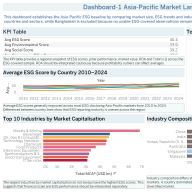
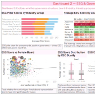
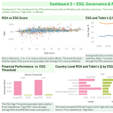

# ESG, Governance & Financial Performance Across Asia-Pacific Markets

A Tableau Story analysing the relationship between ESG performance, corporate governance, and financial outcomes across **nine Asia-Pacific markets** from **2010 to 2024**, with forecasting to 2028.

🔗 **[View the interactive dashboards on Tableau Public](https://public.tableau.com/app/profile/yarida.kaewthong/viz/23020243_Kaewthong_viz/Story1)**

> Part of my Master of Commerce in AI and Business Analytics at Curtin University, Perth.

## Overview

This project investigates how ESG scores relate to governance factors and firm value across Australia, Bangladesh, China, India, Indonesia, the Republic of Korea, Malaysia, New Zealand, and Singapore. The analysis is presented as a three-dashboard Tableau Story.

## The Three Dashboards

### 1. Asia-Pacific Market Landscape



A regional baseline view combining a KPI table (average ESG pillar scores, market capitalisation, ROA, Tobin's Q), a choropleth map of market value, and a top-10 industries breakdown. Key finding: ESG performance and financial scale move independently, so they need to be interpreted separately.

### 2. Governance Drivers



An examination of what drives ESG variation: female board representation, CEO duality, and ESG controversy risk across industries, plus a heat map of ESG scores by country and year. Key finding: governance quality and controversy risk help explain differences in ESG performance.

### 3. ESG and Financial Performance



The relationship between ESG scores and financial metrics (ROA, Tobin's Q, MTB), including an outlier filter and a forecast of ESG and Tobin's Q trends to 2028 with 95% confidence intervals, plus an adjustable ESG threshold parameter.

## Tools & Skills

- **Tableau** (Story, dashboards, choropleth maps, heat maps, scatter plots, forecasting, parameters)
- Financial data analysis (ROA, Tobin's Q, MTB)
- ESG and governance analytics
- Data storytelling

## Repository Structure

```
apac-esg-financial-analysis/
├── README.md
├── esg-asia-pacific-analysis.twbx   # Tableau workbook
├── data/
│   └── esg_dataset.csv              # Dataset (16,752 firm-year records, 2010-2024)
├── images/
│   └── dashboard previews
└── report/
    └── esg-business-analyst-report.pdf   # Full written report
```

## Key Limitations

The ESG dataset is filtered to non-null values for 2010 to 2024, which reduces coverage for smaller markets (Bangladesh drops out, New Zealand is thin). Results therefore skew toward larger firms, and financial ratios can be affected by outliers.
